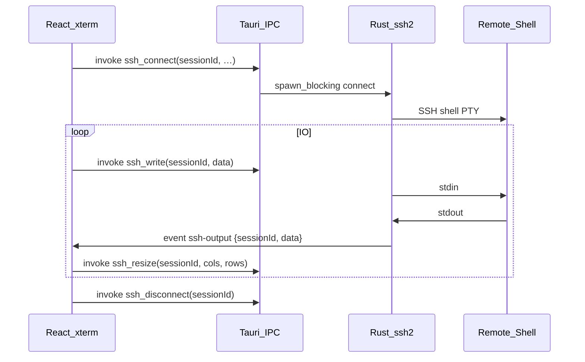

# miterm 开发文档

SSH 远程终端桌面应用 — **MVP 阶段**开发说明。配套 [环境安装清单](环境安装清单.md)、[使用与 Windows 联调说明](使用与Windows联调说明.md) 使用。

---

## 1. 项目概述

| 项 | 说明 |
|----|------|
| 产品名 | **miterm**（原 miterminal） |
| 标识符 | `com.miterm.app`（应用数据目录据此命名） |
| 产品定位 | 以 **SSH 远程终端** 为主的多平台终端工具 |
| MVP | 密码登录 + **多会话 Tab** + xterm + SQLite 保存主机 |
| 技术栈 | Tauri 2、Rust（ssh2 + portable-pty + tokio + rusqlite）、React、TypeScript、xterm.js |
| 主开发 OS | Ubuntu 22.04 |
| 目标用户 OS | Linux / Windows / macOS（发布阶段再配 CI） |

### MVP 功能边界

**包含**

- 主机列表：登录 / 编辑 / 删除 / 分类筛选
- **本地终端**：作为主机条目的一种连接类型（与 SSH 同级）；可归类；Git Bash / 自定义可填路径；`local_connect` + portable-pty
- `ssh_connect` / `local_connect` / `ssh_write` / `ssh_resize` / `ssh_disconnect`（均带 `sessionId`）
- `sftp_list` / `sftp_upload` / `sftp_upload_dir` / `sftp_download` / `sftp_download_dir`（SSH 会话；独立 SFTP 旁路连接）
- `reveal_path`：下载完成后在系统文件管理器中打开/定位本地路径
- SQLite 保存主机（含 `conn_type` / `shell` / `shell_path`）与分类、工作区、**常用命令**（`saved_commands`）
- **主机列表页 / 终端多 Tab 页**（可回列表而不断开）
- xterm.js 显示输出、键盘输入（每会话独立终端）
- 窗口缩放同步 PTY 行列

**不包含（v2+）**

- 私钥 / 证书、跳板机
- 密码加密存储 / `known_hosts` 校验
- 并发会话格子布局自定义（拖分割条改比例）— 主机夹分屏已支持拖条；并发组仍为自动网格
- SFTP 文件传输 — **已做**（远程目录浏览 + 单文件/文件夹上传下载；独立 SFTP 连接，不堵 PTY）
- Tailwind + Shadcn
- 断线自动重连 — **已做**（设置可关；exit / 关 Tab 不自动；含 TCP/SSH keepalive）
- 主机夹右键分屏 — **已做**（水平/垂直拆窗格 + 同机新连接；见下）

---

## 2. 架构



### 数据流要点

1. **ssh2 是同步 API**：`connect`、读 channel 放在 `tokio::task::spawn_blocking` 或独立线程，避免卡住 Tauri 主线程。
2. **多会话**：Rust `HashMap<sessionId, ActiveSession>`（SSH 与本地各一份）；前端主机夹一级 Tab + 二级会话，或并发组网格；每会话一个 xterm。
3. **输出用事件推送**：Rust `emit("ssh-output", { sessionId, data })`，前端按 `sessionId` 过滤后 `terminal.write`（本地 PTY 复用同名事件）。
4. **输入用 invoke**：`terminal.onData` → `invoke('ssh_write', { sessionId, data })`；后端按 id 路由到 SSH 或本地会话。
5. **远程 PTY**：SSH 侧 `request_pty` + `shell` 在服务器上开 shell；**本地 PTY**：`portable-pty` 在本机起 PowerShell / cmd / Git Bash / 自定义进程。
6. **回主机列表不断开**：终端工作区用 `hidden` 隐藏但保持挂载，继续收输出。

---

## 3. 推荐目录结构（初始化后）

环境就绪后执行：

```bash
cd ~/projects/miterm
pnpm create tauri-app . --template react-ts
pnpm install
pnpm add xterm @xterm/addon-fit
```

目标结构：

```
miterm/
├── README.md
├── docs/
│   ├── miterm_no_bg.png           # 品牌源图（透明底）
│   ├── miterm_icon_3d.png         # 粗环假 3D 设计稿
│   ├── miterm-icon-source.png     # 1024 方图（供 tauri icon）
│   ├── _gen_icon.py               # 图标合成脚本
│   ├── 环境安装清单.md
│   ├── Windows环境安装清单.md
│   ├── 使用与Windows联调说明.md
│   └── 开发文档.md
├── package.json
├── public/
│   ├── favicon.png
│   └── icon.png
├── src/
│   ├── App.tsx                # 统一 Tab 主页
│   ├── App.css
│   ├── components/
│   │   ├── AppTabBar.tsx      # 主机列表 + 会话 Tab + 设置 + 窗口控件
│   │   ├── HostListPage.tsx   # 主机列表内容
│   │   ├── HostEditor.tsx     # 新增/编辑主机弹窗
│   │   ├── SettingsModal.tsx  # 设置（快捷键等）
│   │   ├── TerminalView.tsx   # 单会话 xterm 容器
│   │   ├── TerminalWorkspace.tsx # 主机夹：二级悬停条 + 同机再连 + 分屏
│   │   ├── ConcurrentWorkspace.tsx # 并发会话网格格子工作区
│   │   ├── WorkspaceSidebar.tsx # 侧栏：工作区 / 远程文件 / 命令
│   │   ├── SavedCommandsPanel.tsx # 常用命令 CRUD / 填入 / 运行
│   │   ├── RemoteFilePanel.tsx # SFTP 远程目录 / 上传下载
│   │   └── WindowControls.tsx # 最小化/最大化/关闭
│   ├── settings.ts            # 快捷键、重连、终端字号等 localStorage
│   ├── workspace.ts           # 工作区序列化 / SQLite invoke
│   ├── savedCommands.ts       # 常用命令 invoke
│   ├── splitLayout.ts         # 主机夹分屏二叉树布局
│   ├── cwd.ts                 # OSC 7 / 提示符 / cd 路径跟踪
│   ├── types.ts               # HOSTS_TAB_ID、SessionTab、HostFolder、SavedHost 等
│   └── hooks/
│       └── useSshTerminal.ts  # 按 sessionId 绑定 IPC / 事件
└── src-tauri/
    ├── Cargo.toml
    ├── capabilities/
    │   └── default.json
    ├── permissions/
    │   ├── ssh.toml
    │   └── hosts.toml         # 主机保存相关命令权限
    └── src/
        ├── lib.rs             # 注册命令、AppState
        ├── migrate.rs         # 从旧 com.miterminal.app 迁移 hosts.db
        ├── db/
        │   └── mod.rs         # SQLite HostStore
        ├── ssh/
        │   ├── mod.rs         # SSH 会话逻辑
        │   └── sftp_ops.rs    # SFTP 列表与传输
        └── local/
            └── mod.rs         # 本地 PTY（portable-pty）
```

### 前端页面划分（无路由）

| 区域 | 说明 |
|------|------|
| **顶栏 Tab** | 最左固定「主机列表」（不可关闭）；右侧为「并发 · N 台」组 Tab 与**主机夹** Tab（`名称` + 叠层图标+总数 + `·` + 终端图标+当前序号）；「设置」打开配置 |
| **内容区** | 选中「主机列表」显示主机表；选中主机夹显示该机当前二级会话；选中并发组显示网格 |

说明：

- 「增加主机」可选 **远程主机（SSH）** 或 **本地终端**；本地终端可放进分类（如「本地」），非固定首行、非必须。
- **点名称连接**：若该 `savedHostId` 的主机夹已存在 → **只激活该夹、不新建连接**；否则新建主机夹 + 第一条会话（`ssh_connect` / `local_connect`）。
- **主机夹**：一级 Tab 为「名称 · 叠层图标+总数 · 终端图标+当前序号」；工作区顶部热区**悬停**显示二级 Tab（图标+序号）与 **+**（同机再开一条连接）；关二级 = 断一条；关一级 = 断夹内全部；最后一条二级关掉后夹消失。
- **主机夹分屏**：二级 Tab（`FolderSubTab`）内可右键垂直/水平分割；**分屏只增加窗格，不新增二级 Tab**；`+` 才新建二级 Tab；分割线可拖；关窗格只断该连接，关二级 Tab 断其全部窗格。
- **分屏并发输入**：同一二级 Tab 分屏后默认同组；竖线/方块光标；右键加入/退出；一级 Tab 四格图标全选/取消。
- 本地条目右侧为**设置**图标（编辑 Shell 与路径）；远程为编辑图标。
- 切回「主机列表」时终端保持挂载（隐藏），会话继续收输出。
- **设置**（`localStorage` `miterm.settings.v1`）：Tab / 窗格快捷键（含 Ctrl+Alt+方向键）、断线自动重连、Ctrl+滚轮缩放终端字体开关、终端字号等。
- **工作区**（SQLite `workspaces`）：命名保存主机夹/并发组合（布局树 + cwd）；侧栏打开；不存瞬时 sessionId。
- **保存命令**（SQLite `saved_commands`）：侧栏「命令」Tab；CRUD；点击标题填入当前聚焦终端（不回车）；「运行」末尾补换行执行；写入走与键盘相同的并发同步规则。
- **侧栏**：工作区 | 远程文件 | 命令；`Ctrl+Shift+E` 开关；「保存当前」「新建」限宽；主机列表窄屏时横向滚动条为深色。
- **断线与重连**：TCP + SSH keepalive 降低空闲掉线；异常断线时终端打印「连接已断开 → 正在重连…」，成功后继续显示远程 banner；`exit` 等干净退出不自动重连，底部可点「重新连接」；关 Tab / × 不重连。
- **重连恢复工作目录**：交互 `shell()` 保留 Last login；会话种子 `/home/<user>`；相对 `cd` 跟踪；**Tab 补全行不采信**（避免 `cd ai`+Tab 误记成 `/home/…/ai`）；用提示符 `user@host:path$` 与 OSC 7 校正；重连后自动 `cd`。
- **关 Tab**：先移除 UI，再后台断开；SSH teardown 不再阻塞 wait_eof，keepalive 短间隔可停。
- **SFTP 远程文件**：SSH 会话连接后，主机夹二级条或并发格浮层点「文件」打开**左侧**侧栏；**树形展开**浏览目录（懒加载）；**默认跟随**终端 `cwd`；支持单文件/整夹上传与下载（整夹跳过符号链接，单次最多 8000 文件）；进度经 `sftp-progress`（完成后收起）；下载成功后该行「下载」左侧显示「已下载」，点击调用 `reveal_path` 打开本机位置；本机路径不存在时自动清除标记并友好提示；悬停「已下载」可点 × 主动清除标记（不删本机文件）；SFTP 旁路连接，不堵 PTY。
- Ctrl+Tab / Ctrl+Shift+Tab：**仅一级会话 Tab 间**循环（含并发组与主机夹）；回主机列表用 Ctrl+1 或点击。
- Ctrl+Shift+[ / ]：并发组内切换窗格，或主机夹内切换二级会话（可设置中改键）。
- Ctrl+Shift+E：交替打开/关闭远程文件侧栏（仅已连接 SSH；可设置中改键）。设置页按「连接 / Tab 导航 / 窗格 / 远程文件」分组。
- 切到会话 Tab / 二级会话后自动聚焦 xterm，可直接键入。
- **并发会话**：主机列表勾选 ≥2 台 →「并发会话」同时连接；同一组 Tab 内以接近方形的网格同屏；每格悬停浮层可「并/单」加入并发输入；Tab 栏同一位置按钮交替全选/全部取消；键入同步到已加入会话；参与格光标为竖线、未参与为方块（不闪烁）；关组 Tab 断开组内全部。
- 窗口拖动 / 最小化最大化关闭在顶栏统一处理（无系统标题栏）。

---

## 4. 依赖配置

### 4.1 `src-tauri/Cargo.toml`（MVP）

在 `[dependencies]` 增加：

```toml
tauri = { version = "2", features = [] }
tokio = { version = "1", features = ["rt-multi-thread", "macros", "sync", "time"] }
ssh2 = "0.9"
portable-pty = "0.8"
rfd = "0.15"
serde = { version = "1", features = ["derive"] }
serde_json = "1"
parking_lot = "0.12"
```

### 4.2 `package.json`（MVP 前端）

```bash
pnpm add xterm @xterm/addon-fit
```

已有：`@tauri-apps/api`（脚手架自带）。

### 4.3 Tauri 能力 `capabilities/default.json`

确保主窗口允许：

- 自定义命令：`ssh_connect`、`local_connect`、`ssh_write`、`ssh_resize`、`ssh_disconnect`、`sftp_list`、`sftp_upload`、`sftp_upload_dir`、`sftp_classify_local_paths`、`sftp_upload_paths`、`sftp_download`、`sftp_download_dir`
- 事件：前端可订阅 `ssh-output`、`ssh-closed`、`sftp-progress`

（脚手架生成后按 Tauri 2 文档补全 `permissions`，与 `lib.rs` 中 `generate_handler!` 一致。）

---

## 5. Rust 后端接口约定

### 5.1 全局状态

```rust
struct AppState {
    ssh: Arc<SshSessionManager>,      // HashMap<sessionId, ActiveSession>
    local: Arc<LocalSessionManager>,  // HashMap<sessionId, ActiveLocalSession>
    hosts: Arc<HostStore>,
}
```

前端生成 `sessionId`（UUID）并传入 `ssh_connect` / `local_connect`；同 id 再连会静默替换旧会话。`ssh_write` / `ssh_resize` / `ssh_disconnect` 按 id 路由到 SSH 或本地。

### 5.2 命令

| 命令 | 参数 | 返回 | 说明 |
|------|------|------|------|
| `ssh_connect` | `{ params: { sessionId, host, port, username, password, cols, rows } }` | `Result<String, String>` | 成功返回 `sessionId` |
| `local_connect` | `{ params: { sessionId, shell, customPath?, cols, rows } }` | `Result<String, String>` | `shell`: `powershell` / `cmd` / `gitbash` / `custom` |
| `ssh_write` | `sessionId`, `data: Vec<u8>` | `Result<(), String>` | 写入指定会话 stdin（SSH 或本地） |
| `ssh_resize` | `sessionId`, `cols`, `rows` | `Result<(), String>` | 调整远程或本地 PTY 尺寸 |
| `ssh_disconnect` | `sessionId` | `Result<(), String>` | 关闭该会话（主动断开不广播 `ssh-closed`，避免误重连） |
| `sftp_list` | `params: { sessionId, path }` | `{ path, entries[] }` | 列出远程目录（首次自动建旁路 SFTP 连接） |
| `sftp_upload` | `params: { sessionId, remoteDir }` | `Option<remotePath>` | 系统对话框选本地文件并上传；取消为 `null` |
| `sftp_upload_dir` | `params: { sessionId, remoteDir }` | `Option<remoteDir>` | 选本地文件夹，在远端 `remoteDir` 下创建同名目录并递归上传（跳过符号链接；文件数上限 8000） |
| `sftp_classify_local_paths` | `params: { paths }` | `{ files, dirs, skipped }` | 分类本机路径（拖放确认用） |
| `sftp_upload_paths` | `params: { sessionId, remoteDir, paths }` | `remotePath` | 按路径列表上传文件/文件夹（确认后调用） |
| `sftp_download` | `params: { sessionId, remotePath }` | `Option<localPath>` | 系统对话框选保存位置并下载单文件；取消为 `null` |
| `sftp_download_dir` | `params: { sessionId, remotePath }` | `Option<localDir>` | 选本机父目录后递归下载文件夹（跳过符号链接；文件数上限 8000） |
| `reveal_path` | `{ path }` | `Result<(), String>` | 在系统文件管理器打开路径：文件则定位选中，目录则打开该夹；须为已存在的绝对路径 |

### 5.3 事件

| 事件名 | 载荷 | 说明 |
|--------|------|------|
| `ssh-output` | `{ sessionId, data: number[] }` | 指定会话的远程输出 |
| `ssh-closed` | `{ sessionId, reason }` | 通道结束；`reason`: `user` / `remote`（如 exit）/ `error`（异常） |
| `sftp-progress` | `{ sessionId, transferId, direction, remotePath, localPath, bytesDone, bytesTotal, fileIndex, fileCount, done, error? }` | 上传/下载进度；目录下载时 `fileIndex`/`fileCount` 表示文件序号 |

### 5.4 连接流程（`ssh/mod.rs`）

1. `TcpStream::connect((host, port))`
2. `Session::new()` → `set_tcp_stream` → `handshake`
3. `userauth_password(username, password)`
4. `channel_session()` → `request_pty("xterm-256color", …)` → `shell()`
5. 读循环：`emit("ssh-output", { sessionId, data })`
6. 对端关闭 → `emit("ssh-closed", { sessionId, reason: "remote"|"error" })`

### 5.5 已保存主机（SQLite）

库文件：应用数据目录下的 `hosts.db`（Windows 约 `%APPDATA%\com.miterm.app\hosts.db`）。

**从 miterminal 迁移**：启动时若新目录尚无 `hosts.db`，`migrate.rs` 会从旧目录（如 `%APPDATA%\com.miterminal.app\`）拷贝 `hosts.db`（及 wal/shm、`settings.json` 若存在）。`localStorage` 键已改为 `miterm.*`，并兼容读取旧键 `miterminal.*`（仅同一 WebView 配置下有效）。

表 `categories`：`id`, `name`, `sort_order`。  
表 `saved_hosts`：`name` / `host` / `port` / `username` / `password` / `category_id` / `last_used_at`，以及：

| 列 | 说明 |
|----|------|
| `conn_type` | `ssh`（默认）或 `local` |
| `shell` | 本地：`powershell` / `cmd` / `gitbash` / `custom` |
| `shell_path` | 本地可执行路径（Git Bash / 自定义等；可空则自动检测） |

| 命令 | 参数 | 说明 |
|------|------|------|
| `list_saved_hosts` | — | 按最近使用排序返回列表 |
| `save_host` | `{ params: { name, host, port, username, password, categoryId, connType, shell, shellPath } }` | 新增 |
| `update_saved_host` | 同上 + `id` | 按 id 编辑 |
| `delete_saved_host` | `{ id }` | 删除一条 |
| `list_categories` / `create_category` / `update_category` / `delete_category` | 分类 CRUD；删分类后主机变未分类 |

表 `workspaces`：命名工作区（`kind` + JSON `payload`）。  
表 `saved_commands`：`id` / `title` / `body` / `sort_order` / `updated_at`。

| 命令 | 参数 | 说明 |
|------|------|------|
| `list_workspaces` / `save_workspace` / `update_workspace` / `delete_workspace` | 工作区 CRUD | 见侧栏「工作区」 |
| `list_commands` | — | 常用命令列表（按 `sort_order`） |
| `save_command` | `{ params: { title, body } }` | 新增 |
| `update_command` | 同上 + `id` | 编辑 |
| `delete_command` | `{ id }` | 删除 |

### 5.6 安全（MVP）

- **禁止** `println!` 密码；日志可记 host/port/用户名
- 密码以**明文**写入本地 SQLite（便于回填），仅建议受信本机使用；v2 应改为系统凭据库或加密存储
- **暂不校验** `known_hosts`（有中间人风险，v2 必须补）

---

## 6. 前端实现要点

### 6.1 HostListPage + HostEditor

- 列表页：`list_saved_hosts`（含 `connType` / `shell` / `shellPath`）；点名称连接；编辑或设置 / 删除；顶部「增加主机」
- 增加/编辑：可选远程 SSH 或本地终端；本地可选 PowerShell / cmd / Git Bash / 自定义，后两者可填路径
- 连接：若该主机夹已存在则只激活；否则生成 `folderId` + `sessionId` → 主机夹一级 Tab → `ssh_connect` / `local_connect` + `touch_saved_host`
- 关一级主机夹：断开夹内全部；关二级或 `+` 再连：只动单条会话
- 顶栏「设置」→ 快捷键（`miterm.settings.v1`）

### 6.2 TerminalView + xterm（每会话一例）

- `onData` → `invoke('ssh_write', { sessionId, data })`
- `listen('ssh-output')` → 按 `payload.sessionId` 过滤 → `terminal.write`
- `listen('ssh-closed')` → 按 `reason` 处理：异常可自动重连；`remote`（如 exit）保留 Tab 并提示手动重连；主动关 Tab 不依赖该事件
- `resize`：`fit` 后 `invoke('ssh_resize', { sessionId, cols, rows })`
- **激活即聚焦**：一级 Tab / 二级会话 / 格子被选中后 `terminal.focus()`
- **主机夹**：`TerminalWorkspace` 叠放同机会话层；顶部热区悬停显示二级 Tab 与 `+`；右键分屏见 `splitLayout.ts`
- **并发会话**：`ConcurrentWorkspace` 等分网格；浮层顶栏「并/单」；Tab 栏交替全选/取消图标；键入 fan-out `ssh_write`；参与=`bar` 光标、未参与=`block`、均不闪烁

### 6.3 样式

MVP 使用 `App.css`：列表全宽 + 终端 Tab 条 + `terminal-stack` 叠放（非激活 `panel-hidden` + 层 `opacity`）。

---

## 7. 常用命令

| 命令 | 说明 |
|------|------|
| `pnpm tauri dev` | 开发模式（热更新 + 桌面窗口） |
| `pnpm tauri build` |  release 构建 Linux 安装包 |
| `cd src-tauri && cargo build` | 仅编译 Rust（无 GUI，适合 CI 检查） |
| `cd src-tauri && cargo clippy` | Rust 静态检查 |
| `pnpm run build` | 仅构建前端 |

---

## 8. 联调测试清单

环境见 [环境安装清单 §4](环境安装清单.md#4-本机-ssh-测试服务联调必备)。

| # | 步骤 | 预期 |
|---|------|------|
| 1 | `pnpm tauri dev` | 打开后为**连接页**（居中表单） |
| 2 | 填写 `127.0.0.1:22` + 用户密码，点 Connect | 切到**终端页**，出现 shell / MOTD |
| 3 | 执行 `ls`、`pwd` | 输出正确 |
| 4 | 调整窗口大小 | 远程 `stty size` 变化 |
| 5 | 点顶栏 Disconnect | 回到连接页；再连接无僵尸会话 |

### 命令行对照测试

```bash
ssh 用户名@127.0.0.1
# 能通则说明问题在应用层，否则先修 SSH 服务
```

---

## 9. 故障排查

| 现象 | 可能原因 | 处理 |
|------|----------|------|
| 连接一直转圈 | Rust 在主线程阻塞 | 确保 `spawn_blocking` |
| 有连接无输出 | 未 `emit` 或前端未 `listen` | 检查事件名、capabilities |
| 乱码 | 编码不一致 | 统一 UTF-8；xterm `write` 原始字节 |
| vim/top 布局乱 | PTY 尺寸未同步 | 连接后立刻 `fit` + `ssh_resize` |
| Authentication failed | 密码错或禁止密码登录 | `sshd_config` 中 `PasswordAuthentication yes` |
| 编译 libssh2 失败 | 缺 dev 包 | `libssh2-1-dev`、`libssl-dev` |

### sshd 允许密码登录（本机测试）

```bash
sudo grep PasswordAuthentication /etc/ssh/sshd_config
# 若为 no，改为 yes 后:
sudo systemctl restart ssh
```

---

## 10. 后续扩展

按优先级建议：

1. 私钥认证 + `known_hosts` 校验；密码改为加密/系统钥匙串存储  
2. 断线自动重连 — **已做**
3. 多主机同屏（并发会话网格格子）— **已做**
4. SFTP（Rust `sftp`）— **已做**（`sftp_list` / `sftp_upload` / `sftp_upload_dir` / `sftp_download` / `sftp_download_dir`；侧栏面板）
5. Tailwind + Shadcn UI
6. GitHub Actions：`ubuntu` / `windows` / `macos` 矩阵构建  

### CI 备忘（`.github/workflows/release.yml` 草案）

- `ubuntu-latest` → `.deb` / AppImage  
- `windows-latest` → `.msi` / `.exe`  
- `macos-latest` → `.dmg`  

Linux 开发无法本地打出 signed macOS 包，需 CI 或 Mac 实体机。

---

## 11. 变更记录

| 日期 | 说明 |
|------|------|
| 2026-07-18 | 前端改为**连接页 / 终端页**（按 `status` 切换，无 react-router）。新增 `TerminalToolbar`；Connect 后进终端页，Disconnect / `ssh-closed` 回连接页。为后续多 Tab 会话做 UI 铺垫。 |
| 2026-07-18 | **SQLite 保存已登录主机**：`rusqlite` + `db/mod.rs`；命令 `list_saved_hosts` / `save_host` / `delete_saved_host`；连接页展示历史并回填（含密码明文，仅本机便利）。 |
| 2026-07-18 | 主机页改为**列表为主**：每行登录 / 编辑 / 删除，顶部增加；`HostEditor` 弹窗；新增 `update_saved_host` / `touch_saved_host`。 |
| 2026-07-18 | 列表增加 **名称** 列（空则用 IP）；操作改为紧凑图标按钮。 |
| 2026-07-18 | 主机列表改为**左右分栏**：左侧分类树（全部/未分类/自定义），右侧按分类筛选；编辑可选分类。 |
| 2026-07-18 | 分类改为**列表上方筛选下拉**（去掉左栏）；可新建/重命名/删除当前筛选分类。 |
| 2026-07-18 | **多会话 Tab**：后端 `HashMap` + 命令/事件带 `sessionId`；终端多 Tab；关 Tab 即断开；可回主机列表而不断开（工作区隐藏保活）。 |
| 2026-07-18 | 去掉系统标题栏（`decorations: false`）；最小化/最大化/关闭嵌在列表顶栏与终端 Tab 条，拖动用 `data-tauri-drag-region`。 |
| 2026-07-18 | 统一主页 Tab：最左固定「主机列表」不可关闭；右侧会话 Tab 同级切换；去掉独立列表页跳转。 |
| 2026-07-18 | Disconnect 改为**设置**；可自定义 Tab 切换快捷键（localStorage）；默认 Ctrl+Tab / Ctrl+Shift+Tab 与 Ctrl+1～9。 |
| 2026-07-19 | 主窗口透明 + CSS 圆角（Win10 观感）；`shadow: false`；最大化时取消圆角。 |
| 2026-07-19 | **本地终端**：`portable-pty` + `local_connect`；复用 `ssh-output` / `ssh_write` / `ssh_resize` / `ssh_disconnect`。 |
| 2026-07-19 | 终端聚焦时 Ctrl+Tab 可切换 Tab（不再被 xterm textarea 拦截）；切换到会话 Tab 后自动 `terminal.focus()`，无需再点击输入。 |
| 2026-07-19 | Ctrl+Tab / Ctrl+Shift+Tab 仅在会话 Tab 间循环，不再经过「主机列表」（回列表仍用 Ctrl+1 或点击）。 |
| 2026-07-25 | **并发窗格快捷键**：默认 Ctrl+Shift+[ / ] 在组内循环焦点；设置中可改；终端内可用。 |
| 2026-07-19 | 本地终端改为主机条目连接类型（`conn_type`/`shell`/`shell_path`）；增加主机可选远程/本地；列表不再固定首行；Git Bash 等可填路径；条目右侧设置图标编辑。 |
| 2026-07-19 | **并发会话**：列表复选框 +「并发会话」同时连接；组 Tab「并发 · N 台」内网格格子同屏；移除顶栏左右分屏。 |
| 2026-07-24 | **并发命令下发**：组 Tab 底部「发送到全部」，向已连接会话写入同一命令并回车；跳过未连接会话并提示成功数。 |
| 2026-07-24 | **并发同步输入**：去掉底部命令栏；每格「并/单」加入组；全选/全部取消；任意格键入同步到组成员；参与格光标闪烁。 |
| 2026-07-25 | **主机夹二级会话**：一级 Tab「名称 + 叠层总数 + 终端当前序号」；悬停显示二级条与同机 `+`；列表点名称若夹已存在则只激活不新建。 |
| 2026-07-25 | **断线重连 + keepalive**：TCP/SSH keepalive；异常断线可自动重连（次数可配）；`exit` 仅提示手动重连；关 Tab 不重连；终端内打印状态文案。 |
| 2026-07-26 | **重连恢复工作目录**：OSC 7 + 绝对路径 `cd` 跟踪；相对 `cd` 等 OSC，避免错误拼接；重连后自动 `cd`。 |
| 2026-07-26 | **修复错误恢复路径**：不用 Windows `URL` 解析 file://；相对 cd 不再本地拼接；连接后补装 OSC 7 hook。 |
| 2026-07-26 | **登录体验 / 恢复目录 / 关 Tab**：恢复 `shell()` 保留 Last login；家目录种子+相对 cd；乐观关 Tab + 快速 teardown。 |
| 2026-07-26 | **修复 Tab 补全误路径**：有 Tab 的行跳过相对 cd 推断；从提示符 / OSC 7 校正真实目录。 |
| 2026-07-27 | **SFTP 远程文件**：旁路 SSH 连接；`sftp_list` / 上传 / 下载；主机夹与并发格「文件」侧栏；进度事件 `sftp-progress`。 |
| 2026-07-28 | **远程文件树形 UI**：懒加载展开文件夹；滚动条与终端/设置一致；上传目标跟随选中目录。 |
| 2026-07-29 | **SFTP 文件夹下载**：`sftp_download_dir` 递归下载；进度含文件序号；跳过符号链接；单次最多 8000 文件。 |
| 2026-08-02 | **SFTP 文件夹上传**：`sftp_upload_dir`；远端创建同名目录并递归上传；进度含文件序号；跳过符号链接；上限 8000 文件。 |
| 2026-08-02 | **SFTP 上传区**：合并「上传…」菜单；拖放区 + 确认后 `sftp_upload_paths`。 |
| 2026-08-02 | **主机夹分屏**：右键垂直/水平分割；同机新连接；二叉树布局 + 拖分割条；关窗格断对应会话。 |
| 2026-08-03 | **分屏并发输入**：主机夹分屏复用并发组同步；默认同组；竖线/方块光标；右键与 Tab 全选。 |
| 2026-08-02 | **远程文件跟随 cwd 去抖动**：默认跟随；不采纳 null；提示符误报的「非家→家」忽略；`cd`/OSC 7 仍可信；可关跟随。 |
| 2026-08-02 | **更名 miterm**：`productName` / `identifier`（`com.miterm.app`）/ Cargo / npm / 文档；应用图标改为 `docs/miterm.png`；启动时从旧 `com.miterminal.app` 迁移 `hosts.db`。 |
| 2026-08-02 | **应用图标**：改用透明底 `docs/miterm_no_bg.png` 重新生成全套 icons / favicon。 |
| 2026-08-02 | **图标强化**：紧裁约 1% 边；保留 M/进度条，外圈改为单层粗环假 3D（`_gen_icon.py`）。 |
| 2026-08-02 | **图标 M**：冰蓝亮色 + 轻 bevel/描边/投影，与外环光向一致。 |
| 2026-08-02 | **图标整体加立体**：环更强高光/唇边；内盘 AO；M emboss；进度条顶部高光。 |
| 2026-08-03 | **终端字号缩放**：设置可改字号（10～28）；默认启用 Ctrl+滚轮仅缩放终端字体；改后 fit + ssh_resize。 |
| 2026-08-04 | **田字分割**：右键四分屏，同机再开 3 连接；二叉树 2×2。 |
| 2026-08-04 | **工作区侧栏**：SQLite 保存/打开命名组合；侧栏 Tab「工作区 / 远程文件」；打开总是新开一级 Tab；Ctrl+Alt+方向键按布局聚焦相邻窗格。 |
| 2026-08-10 | **主机列表「收藏会话」**：并发会话按钮左侧开关侧栏（默认工作区 Tab），与 Ctrl+Shift+E 共用状态。 |
| 2026-08-10 | **SFTP 下载打开目录**：`reveal_path`；下载完成后进度条收起，该行「已下载」可打开本机位置。 |
| 2026-08-10 | **已下载标记清理**：本机路径不存在时自动清标记；悬停「已下载」显示 × 可主动清除。 |
| 2026-08-10 | **保存命令**：侧栏「命令」Tab；SQLite `saved_commands`；点击填入 / 「运行」回车；跟随并发同步。 |
| 2026-08-10 | **侧栏窄屏 UI**：主机列表横向滚动条改为深色；「保存当前」「新建」按钮限宽，不随侧栏拉宽。 |

---

## 12. 品牌与图标

| 文件 | 用途 |
|------|------|
| `docs/miterm_no_bg.png` | 品牌源图（透明底；取中心 M + 进度条） |
| `docs/miterm_icon_3d.png` | 程序合成的粗环假 3D 设计稿 |
| `docs/miterm-icon-source.png` | 紧裁（约 1% 边）后的 1024×1024，供 `tauri icon` |
| `docs/_gen_icon.py` | 从图标源合成粗环 3D 稿的脚本 |
| `src-tauri/icons/*` | Tauri 打包 / 任务栏 / 窗口图标（含 `.ico` / `.icns`） |
| `public/favicon.png`、`public/icon.png` | 前端开发页 favicon |

重新生成图标（源图或环样式变更后）：

```powershell
python docs\_gen_icon.py
pnpm tauri icon docs/miterm-icon-source.png
Copy-Item -Force src-tauri\icons\32x32.png public\favicon.png
Copy-Item -Force src-tauri\icons\128x128.png public\icon.png
```

Windows 若仍显示旧图标，删除 `src-tauri\target` 后重新 `pnpm tauri dev`，或注销/重启以清图标缓存。

---

## 13. 参考链接

- [Tauri 2 Prerequisites](https://v2.tauri.app/start/prerequisites/)
- [Tauri 2 Create Project](https://v2.tauri.app/start/create-project/)
- [Tauri Icon](https://v2.tauri.app/reference/cli/#icon)
- [xterm.js](https://xtermjs.org/)
- [rust ssh2 crate](https://docs.rs/ssh2/latest/ssh2/)
- [terminal.icu](https://www.terminal.icu/)（产品参考）
